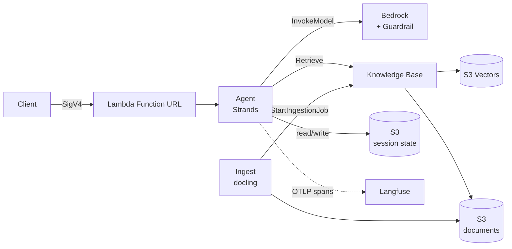
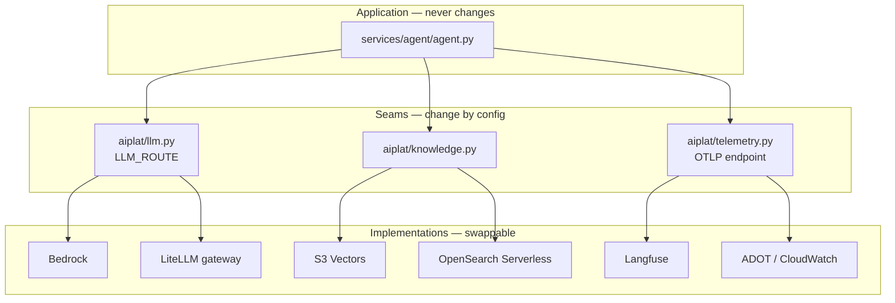

# Architecture

How the system is wired. For *why* it is split this way — platform layer versus
workload layer, and what is still missing — see [platform.md](platform.md).

## Request flow

Two paths, deliberately separate:

- **Write path** — `docling` parses PDF/DOCX to Markdown locally, uploads to S3 with a
  metadata sidecar, then triggers a Knowledge Base ingestion job. Runs on a laptop or
  a container, never in Lambda (docling pulls model weights).
- **Read path** — the agent retrieves passages, reasons over them, and answers with
  `[n]` citations. Every model call and tool call emits an OTLP span.

## Where the seams are

Three seams, chosen because these are the three decisions most likely to be revisited:
which model provider, which vector store, where traces go. Everything else can be
edited in place.

## Decisions and their costs

### S3 Vectors instead of OpenSearch Serverless

**Why.** OpenSearch Serverless bills a minimum OCU floor continuously — several
hundred dollars a month for an environment nobody is querying. For a reference
platform, or any workload with bursty traffic, that dominates the bill.

**Cost.** Higher query latency, and none of OpenSearch's tuning surface — no custom
analyzers, no BM25 weighting, no aggregations. If retrieval latency becomes the
bottleneck, this is the first thing to change.

### Lambda instead of Fargate for the agent

**Why.** The agent is stateless, traffic is bursty, and idle cost is zero.

**Cost.** No response streaming through a Function URL, a 15-minute ceiling, and cold
starts. All three are escaped by moving to AgentCore Runtime — which is why
`agentcore_app.py` exists in the repo from day one rather than as a future migration.

### Retrieve, not RetrieveAndGenerate

**Why.** `RetrieveAndGenerate` folds retrieval and generation into one opaque call.
Splitting them lets the agent combine retrieval with other tools in a single turn, and
makes the generation step traceable.

**Cost.** More tokens — passages go through the model's context rather than staying
server-side.

### Hierarchical chunking

**Why.** Small children chunks match precisely; large parent chunks give the model
enough context to answer. Fixed-size chunking forces a choice between the two.

**Cost.** More storage and a slower ingestion job.

### Guardrails in their own stack

**Why.** Safety policy is owned by a different team and changes on a different cadence
than application code. Coupling them means every prompt tweak is also a policy change,
which is exactly what an audit will flag.

**Cost.** One more stack, and a cross-stack reference to wire up.

## Scaling path

| Pressure | Change | Application code affected |
|---|---|---|
| Retrieval too slow | S3 Vectors → OpenSearch Serverless | None |
| Need streaming / long sessions | Lambda → AgentCore Runtime | None |
| Multiple teams sharing budget | `LLM_ROUTE=gateway` + LiteLLM proxy | None |
| Non-Bedrock models needed | Same as above | None |
| Traces must go to CloudWatch | Point OTLP at an ADOT collector | None |

That column is the point of the whole design.
