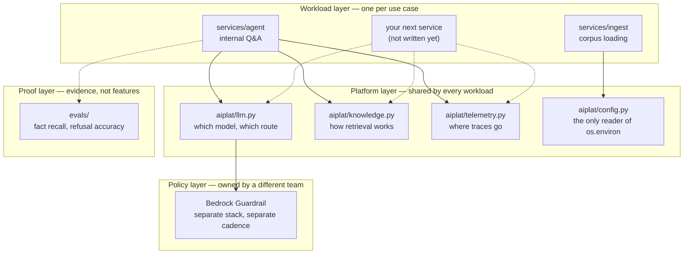

# What makes this a platform

A fair question to ask of any repo with "platform" in the name: this ships one
agent answering one kind of question. What separates it from an application with
good folder structure?

The short answer: an application is built to *do* something; a platform is built
to be *built on*. This repo is organised as the second, currently hosting one
instance of the first. That is a real architectural distinction, and it is also
less than a finished platform — both halves are documented below.

---

## The line, drawn concretely

The test for whether something belongs in `aiplat/` rather than `services/`:
**would a second workload need it too?** Model construction, retrieval, tracing,
and configuration all pass. The agent's system prompt does not — that is specific
to one use case, so it lives in `services/agent/agent.py`.

| Layer | Who owns it | Changes | Example |
|---|---|---|---|
| Workload | The team with the use case | Weekly | A prompt, a new tool |
| Platform | Whoever runs the platform | Monthly | Swapping the vector store |
| Policy | Security / compliance | Quarterly, with audit | PII masking rules |
| Proof | Both | Every change | An eval case for a new failure mode |

Coupling these is what turns a platform back into an application. If a prompt
tweak and a guardrail change must ship together, an auditor will object — and
they will be right.

---

## Five things that make it a platform rather than an agent

**1. Application code does not name its dependencies.** `services/agent/agent.py`
never imports `BedrockModel`. It asks `aiplat` for a model and gets whatever the
platform is configured to hand out. That is the difference between "an app that
calls Bedrock" and "an app running on a platform that happens to use Bedrock."

**2. The seams are declared, not incidental.** Three decisions get revisited in
every real system — which model provider, which vector store, where traces go —
and each has exactly one file that owns it. From `docs/architecture.md`:

| Pressure | Change | Application code affected |
|---|---|---|
| Retrieval too slow | S3 Vectors → OpenSearch Serverless | None |
| Need streaming | Lambda → AgentCore Runtime | None |
| Multiple teams sharing budget | `LLM_ROUTE=gateway` | None |

That last column is the whole claim. If it read "rewrite the agent," this would
be an application.

**3. Runtime is a deployment decision.** `agent.py` knows nothing about Lambda.
The same object runs under `lambda_handler.py`, under `agentcore_app.py`, or in a
local process. Workloads that are portable across runtimes are the thing
platforms exist to produce.

**4. Safety is a separate plane.** The guardrail is its own stack with its own
lifecycle. Application teams consume it; they do not edit it.

**5. Quality is measured centrally.** `evals/` scores fact recall, refusal
accuracy, and citation rate for any workload that plugs into it. A platform that
cannot tell you whether a change made things worse is a deployment script.

---

## What it is not yet

Honest gaps. Each is real work, not a footnote.

| Missing | Why it matters | Rough shape of the fix |
|---|---|---|
| **Multi-tenancy** | `tenant` is a trace label, not an isolation boundary. Every caller sees the same knowledge base. | Per-tenant KB or metadata filtering, plus tenant-scoped IAM |
| **Self-service onboarding** | A second team cannot get started without someone editing CDK for them. | A workload template + a pipeline that provisions per-team resources |
| **More than one workload** | One consumer cannot prove an abstraction is right. The second one always finds what the first got wrong. | Build a genuinely different service — summarisation, classification — on the same `aiplat` |
| **End-user authn/authz** | IAM auth protects the endpoint from strangers, not user A's documents from user B. | Identity in front (Cognito / OIDC), identity propagated into retrieval filters |
| **Cost attribution** | You can see total Bedrock spend, not spend per team. | Per-tenant virtual keys via the gateway; that is what it is for |
| **Prompt lifecycle** | Prompts are literals in source. No versioning, no A/B, no rollback independent of deploy. | A prompt registry with versions the eval suite scores |

Until multi-tenancy and a second workload exist, the accurate description is
**reference platform**: correct structure, one tenant, one use case. The README
says exactly that, and the phrasing is deliberate.

---

## Why build it this way before it is needed

The seams cost almost nothing now and are expensive to retrofit. `LLM_ROUTE` is
about fifteen lines; adding a gateway to a codebase where forty call sites
construct their own Bedrock client is a migration. Same for the guardrail stack
split, and for the eval harness — writing it after a quality regression means you
cannot tell whether the regression is new.

The parts deliberately *not* built early are the ones with a standing cost or a
guessable-wrong shape: multi-tenancy designed for imaginary tenants usually
models the wrong boundary, and self-service tooling for one team is overhead.

---

## Deciding where a change goes

When adding something, ask in this order:

1. **Would a second workload need it?** No → `services/`. Yes → continue.
2. **Does it change based on who is calling?** Yes → it is a tenancy concern; the
   platform does not handle that yet, so say so rather than hard-coding a tenant.
3. **Would security or compliance want to review it separately?** Yes → its own
   stack, like the guardrail.
4. **Can it be wrong in a way users would notice?** Yes → it needs an eval case
   before it ships.

Answering (1) with "maybe someday" is how platform layers accumulate abstractions
nobody uses. Wait for the second caller.
